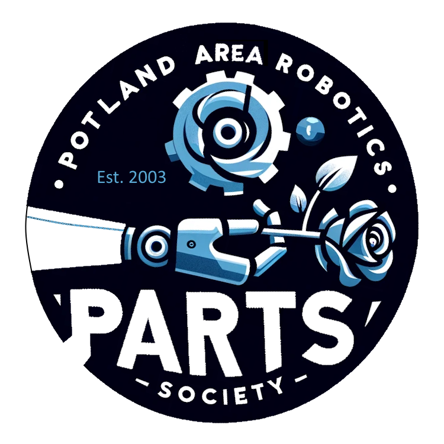
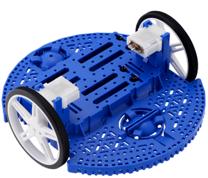
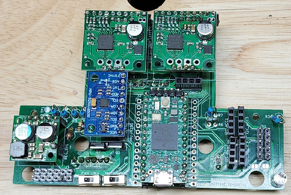
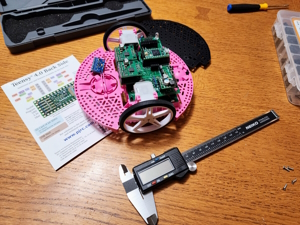

<!-- PROJECT SHIELDS -->
<!--
*** I'm using markdown "reference style" links for readability.
*** Reference links are enclosed in brackets [ ] instead of parentheses ( ).
*** See the bottom of this document for the declaration of the reference variables
*** for contributors-url, forks-url, etc. This is an optional, concise syntax you may use.
*** https://www.markdownguide.org/basic-syntax/#reference-style-links
-->
[![Contributors][contributors-shield]][contributors-url]
[![Forks][forks-shield]][forks-url]
[![Stargazers][stars-shield]][stars-url]
[![Issues][issues-shield]][issues-url]
[![MIT License][license-shield]][license-url]

<!-- PROJECT LOGO -->
 

  

  <h3 align="center">Portland Area Robotics Society -- Common Robotics Platform</h3>

  

    Build and master the Common Robotics Platform with Portland Area Robotics Society 
     
    <a href="https://parts-common-platform.readthedocs.io/en/latest/"><strong>Explore the docs »</strong></a>
     
     
    <a href="https://github.com/portlandrobotics/common_platform">View Demo</a>  <!-- TODO We need to add a demo video here -->
    ·
    <a href="https://github.com/portlandrobotics/common_platform/issues">Report Bug</a>
    ·
    <a href="https://github.com/portlandrobotics/common_platform/issues">Request Feature</a>
  

<!-- TABLE OF CONTENTS -->

  
Table of Contents

  <ol>
    <li>
      <a href="#about-the-project">About The Project</a>
      <ul>
        <li><a href="#built-with">Built With</a></li>
      </ul>
    </li>
    <li>
      <a href="#getting-started">Getting Started</a>
      <ul>
        <li><a href="#prerequisites">Prerequisites</a></li>
        <li><a href="#installation">Installation</a></li>
      </ul>
    </li>
    <li><a href="#usage">Usage</a></li>
    <li><a href="#roadmap">Roadmap</a></li>
    <li><a href="#contributing">Contributing</a></li>
    <li><a href="#license">License</a></li>
    <li><a href="#contact">Contact</a></li>
    <li><a href="#acknowledgments">Acknowledgments</a></li>
  </ol>

<!-- ABOUT THE PROJECT -->
## About The Project

 

  

 

Our project centers around the innovative construction and programming of a versatile robot using the robust Pololu Romi Chassis Kit as its foundation. At the heart of our design is a custom carrier PCB, which integrates seamlessly with the chassis, ensuring a compact and efficient layout. 

 

  
 
 

Key components of our build include two TB9051FTG Single Brushed DC Motor Driver Carriers for precise motion control, and a Pololu 5V, 2.5A Step-Down Voltage Regulator D24V22F5 to ensure stable power supply. Navigation and orientation are handled by the sophisticated MPU-9250 9DOF Module, a nine-axis sensor that offers unparalleled accuracy in movement tracking. Additional hardware includes a set of Romi Encoders, a Romi Chassis Caster for stable maneuverability, and a powerful Teensy 4.0 microcontroller for robust processing capabilities. We've also incorporated an SPDT slide switch and two IRFU5505PBF transistors, supported by a suite of nine resistors of varying values to fine-tune our circuitry. 

 

  

 

Looking towards the future, our vision is to enhance this platform by integrating a Raspberry Pi, aiming to achieve autonomous functionality through the advanced capabilities of ROS2. This robot is not just a machine, but a gateway to exploring the vast possibilities of robotics, making it an ideal platform for enthusiasts and innovators alike in the Portland Area Robotics Society.

(<a href="#readme-top">back to top</a>)

### Built With

* [![CPP][cpp]][cpp-url]
* [![C][c]][c-url]
* [![Python 3][python]][python-url]
* [![PlatformIO][platformio]][platformio-url]
* [![Arduino][arduino-ide]][arduino-url]
* [![KiCadEDA][kicad]][kicad-url]
* [![ROS][ros]][ros-url]

(<a href="#readme-top">back to top</a>)

<!-- GETTING STARTED -->
## Getting Started

### Prerequisites

* All the required parts from the BOM on hand. [BOM](/BOM.csv)
* Windows/Mac/Linux PC
* Soldering supplies

### Installation

Welcome to the setup guide for the PARTS Common Robotics Platform. Follow these steps to prepare your hardware and software for an exciting journey into robotics!

#### 1. Solder Your PARTS CRP Board
Soldering the PARTS CRP board is the first crucial step. Follow the instructions carefully to ensure a successful setup.

- **Interactive BOM**: Utilize the [Interactive BOM](https://htmlpreview.github.io/?https://github.com/portlandrobotics/common_platform/blob/master/hardware/romi_board/bom/ibom.html) for an easier soldering process.
- **Headers for Connectivity**: We recommend using headers for connections between boards. This makes disassembly possible if needed.
  - Use female (socket) headers on the bottom board.
  - Use male (pin) headers on the top board. These are typically included with all breakout boards.
- **MOSFET Orientation**: Ensure the correct orientation of the MOSFETs during soldering.
- **Resistor for Battery Voltage Divider**: Choose the resistor based on your battery choice:
  - Use a 2M ohm resistor (R1) for 6 AA batteries.
  - Opt for a 3M ohm resistor if using higher voltage batteries like 2 LiPo batteries.
  - Install a >100 pf capacitor across R2 to address voltage drop issues.
- **Teensy Board Modification**: For battery power, cut the trace on the Teensy board. Refer to the note "Cut to separate VIN from VUSB" on the [Teensy 4.0 Back Side](https://github.com/portlandrobotics/common_platform/blob/master/hardware/main_schematic.pdf) image.
- **Resistor Values**: The values of R4, R5, R8, R9 depend on your specific usage. For I2C, 4.7k is appropriate.
- **Schematic**: Refer to the [Main Schematic](https://github.com/portlandrobotics/common_platform/blob/master/hardware/main_schematic.pdf) for detailed understanding.

#### 2. Solder Accessories
Solder accessories like the Inertial Measurement Unit (IMU), ensuring proper orientation and connection.

#### 3. Assemble the Pololu Romi Chassis
The Pololu Romi Chassis forms the physical structure of your robot.

- Follow the [Romi Chassis Assembly Guide](https://www.pololu.com/docs/0J68/4) for detailed instructions on assembling the chassis.

#### 4. Install Arduino IDE
The Arduino Integrated Development Environment (IDE) is essential for programming your robot.

- Download and install the [Arduino IDE](https://www.arduino.cc/en/Main/Software) suitable for your operating system.

#### 5. Clone PARTS CRP Repository
Get the latest codebase for the PARTS CRP project by cloning the repository.

- Use Git to clone the repository or download it directly from the [PARTS CRP GitHub page](https://github.com/portlandrobotics/common_platform).

_For detailed instructions, please refer to the [Documentation](https://parts-common-platform.readthedocs.io/en/latest/)_

(<a href="#readme-top">back to top</a>)

## Usage

This section provides practical examples of how to use the PARTS Common Robotics Platform effectively. We'll start with a basic test to ensure your setup is functioning correctly.

### Starting with the Basic Test

1. **Flash the Teensy 4.0 Board:**
   Begin by flashing the Teensy 4.0 board with the basic test code found in the repository at `/firmware/basic_test/basic_test.ino`. This initial test is crucial for validating your setup.

2. **Expected Behavior:**
   Upon successful flashing, the robot should exhibit a simple behavior pattern: moving forward, pausing, and then moving backward.

_For more examples, please refer to the [Documentation](https://parts-common-platform.readthedocs.io/en/latest/)_

(<a href="#readme-top">back to top</a>)

<!-- ROADMAP -->
## Roadmap

- [ ] Build hardware library for common robotics platform
- [ ] Build manual for open robotics platform
     - [ ] SBC
     - [ ] Microcontroller
     - [ ] Software
     - [ ] Power
     - [ ] Motion
     - [ ] Communication
     - [ ] Sensors and cameras
     - [ ] Soldering
     - [ ] PCB design and ordering
- [ ] Create 3D model of platform for Gazebo and other sims
- [ ] ROS2 Setup
    - [ ] micro-ROS + ROS2 Humble
    - [ ] control
    - [ ] commuication
    - [ ] navigation
    - [ ] avoidance
 - [ ] Demo of system

See the [open issues](https://github.com/portlandrobotics/common_platform/issues) for a full list of proposed features (and known issues).

(<a href="#readme-top">back to top</a>)

<!-- CONTRIBUTING -->
## Contributing

Contributions are what make the open source community such an amazing place to learn, inspire, and create. Any contributions you make are **greatly appreciated**.

If you have a suggestion that would make this better, please fork the repo and create a pull request. You can also simply open an issue with the tag "enhancement".
Don't forget to give the project a star! Thanks again!

1. Fork the Project
2. Create your Feature Branch (`git checkout -b feature/AmazingFeature`)
3. Commit your Changes (`git commit -m 'Add some AmazingFeature'`)
4. Push to the Branch (`git push origin feature/AmazingFeature`)
5. Open a Pull Request

(<a href="#readme-top">back to top</a>)

<!-- LICENSE -->
## License

Distributed under the MIT License and the Solderpad Hardware License v2.1. See [LICENSE.txt][license-url] for more information.

(<a href="#readme-top">back to top</a>)

<!-- MARKDOWN LINKS & IMAGES -->
<!-- https://www.markdownguide.org/basic-syntax/#reference-style-links -->
[contributors-shield]: https://img.shields.io/github/contributors/portlandrobotics/common_platform.svg?style=for-the-badge
[contributors-url]: https://github.com/portlandrobotics/common_platform/graphs/contributors
[forks-shield]: https://img.shields.io/github/forks/portlandrobotics/common_platform.svg?style=for-the-badge
[forks-url]: https://github.com/portlandrobotics/common_platform/network/members
[stars-shield]: https://img.shields.io/github/stars/portlandrobotics/common_platform.svg?style=for-the-badge
[stars-url]: https://github.com/portlandrobotics/common_platform/stargazers
[issues-shield]: https://img.shields.io/github/issues/portlandrobotics/common_platform.svg?style=for-the-badge
[issues-url]: https://github.com/portlandrobotics/common_platform/issues
[license-shield]: https://img.shields.io/badge/license-mit_%26_solderpad-brightgreen?style=for-the-badge
[license-url]: https://github.com/portlandrobotics/common_platform/blob/master/LICENSE.txt
[arduino-ide]: https://img.shields.io/badge/Arduino_IDE-00979D?style=for-the-badge&logo=arduino&logoColor=white
[arduino-url]: https://www.arduino.cc/en/software
[cpp]: https://img.shields.io/badge/C%2B%2B-00599C?style=for-the-badge&logo=c%2B%2B&logoColor=white
[cpp-url]: https://en.wikipedia.org/wiki/C%2B%2B
[c]: https://img.shields.io/badge/C-00599C?style=for-the-badge&logo=c&logoColor=white
[c-url]: https://en.wikipedia.org/wiki/C_(programming_language)
[python]: https://img.shields.io/badge/Python-3776AB?style=for-the-badge&logo=python&logoColor=white
[python-url]: https://www.python.org/
[platformio]: https://img.shields.io/badge/PlatformIO-F5822A.svg?style=for-the-badge&logo=PlatformIO&logoColor=white
[platformio-url]: https://platformio.org/
[kicad]: https://img.shields.io/badge/KiCad-314CB0.svg?style=for-the-badge&logo=KiCad&logoColor=white
[kicad-url]: https://www.kicad.org/
[ros]: https://img.shields.io/badge/ROS-22314E.svg?style=for-the-badge&logo=ROS&logoColor=white
[ros-url]:https://www.ros.org/
