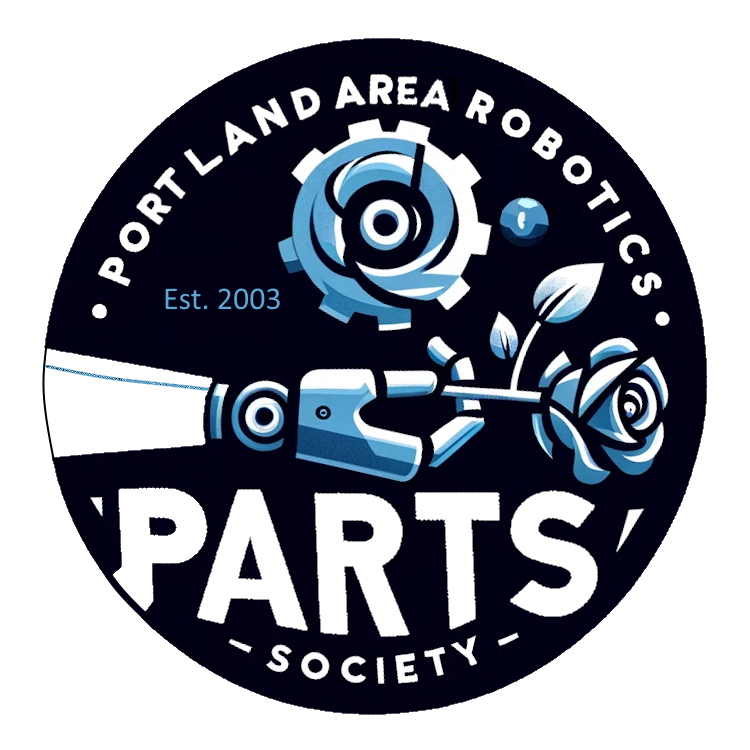

<a name="readme-top"></a>

<!-- PROJECT SHIELDS -->
<!--
*** I'm using markdown "reference style" links for readability.
*** Reference links are enclosed in brackets [ ] instead of parentheses ( ).
*** See the bottom of this document for the declaration of the reference variables
*** for contributors-url, forks-url, etc. This is an optional, concise syntax you may use.
*** https://www.markdownguide.org/basic-syntax/#reference-style-links
-->
[![Contributors][contributors-shield]][contributors-url]
[![Forks][forks-shield]][forks-url]
[![Stargazers][stars-shield]][stars-url]
[![Issues][issues-shield]][issues-url]
[![MIT License][license-shield]][license-url]


<!-- PROJECT LOGO -->
<br />
<div align="center">
  <a href="https://portlandrobotics.org/home.php?link_id=1">
    
  </a>

  <h3 align="center">Portland Area Robotics Society -- Common Robotics Platform</h3>

  <p align="center">
    Build and master the Common Robotics Platform with Portland Area Robotics Society 
    <br />
    <a href="https://parts-common-platform.readthedocs.io/en/latest/"><strong>Explore the docs »</strong></a>
    <br />
    <br />
    <a href="https://github.com/portlandrobotics/common_platform">View Demo</a>  <!-- TODO We need to add a demo video here -->
    ·
    <a href="https://github.com/portlandrobotics/common_platform/issues">Report Bug</a>
    ·
    <a href="https://github.com/portlandrobotics/common_platform/issues">Request Feature</a>
  </p>
</div>


<!-- TABLE OF CONTENTS -->
<details>
  <summary>Table of Contents</summary>
  <ol>
    <li>
      <a href="#about-the-project">About The Project</a>
      <ul>
        <li><a href="#built-with">Built With</a></li>
      </ul>
    </li>
    <li>
      <a href="#getting-started">Getting Started</a>
      <ul>
        <li><a href="#prerequisites">Prerequisites</a></li>
        <li><a href="#installation">Installation</a></li>
      </ul>
    </li>
    <li><a href="#usage">Usage</a></li>
    <li><a href="#roadmap">Roadmap</a></li>
    <li><a href="#contributing">Contributing</a></li>
    <li><a href="#license">License</a></li>
    <li><a href="#contact">Contact</a></li>
    <li><a href="#acknowledgments">Acknowledgments</a></li>
  </ol>
</details>


<!-- ABOUT THE PROJECT -->
## About The Project

<br>
<p align="center">
  <a href="https://www.pololu.com/category/203/romi-chassis-kits">
    
  </a>
</p>
<br>

Our project centers around the innovative construction and programming of a versatile robot using the robust Pololu Romi Chassis Kit as its foundation. At the heart of our design is a custom carrier PCB, which integrates seamlessly with the chassis, ensuring a compact and efficient layout. 

<br>
<p align="center">
  <a href="https://portlandrobotics.org/home.php?link_id=1">
    
  </a>
<br>
<br>

Key components of our build include two TB9051FTG Single Brushed DC Motor Driver Carriers for precise motion control, and a Pololu 5V, 2.5A Step-Down Voltage Regulator D24V22F5 to ensure stable power supply. Navigation and orientation are handled by the sophisticated MPU-9250 9DOF Module, a nine-axis sensor that offers unparalleled accuracy in movement tracking. Additional hardware includes a set of Romi Encoders, a Romi Chassis Caster for stable maneuverability, and a powerful Teensy 4.0 microcontroller for robust processing capabilities. We've also incorporated an SPDT slide switch and two IRFU5505PBF transistors, supported by a suite of nine resistors of varying values to fine-tune our circuitry. 

<br>
<p align="center">
  <a href="https://www.pololu.com/category/203/romi-chassis-kits">
    
  </a>
</p>
<br>

Looking towards the future, our vision is to enhance this platform by integrating a Raspberry Pi, aiming to achieve autonomous functionality through the advanced capabilities of ROS2. This robot is not just a machine, but a gateway to exploring the vast possibilities of robotics, making it an ideal platform for enthusiasts and innovators alike in the Portland Area Robotics Society.

<p align="right">(<a href="#readme-top">back to top</a>)</p>


### Built With

* [![CPP][cpp]][cpp-url]
* [![C][c]][c-url]
* [![Python 3][python]][python-url]
* [![PlatformIO][platformio]][platformio-url]
* [![Arduino][arduino-ide]][arduino-url]
* [![KiCadEDA][kicad]][kicad-url]
* [![ROS][ros]][ros-url]

<p align="right">(<a href="#readme-top">back to top</a>)</p>


<!-- GETTING STARTED -->
## Getting Started

### Prerequisites

* All the required parts from the BOM on hand. [BOM](/BOM.csv)
* Windows/Mac/Linux PC
* Soldering supplies


### Installation

_Below is an example of how you can instruct your audience on installing and setting up your app. This template doesn't rely on any external dependencies or services._

1. Solder your PARTS CRP Board
2. Solder accessories like the IMU
3. Assemble the Pololu Romi Chassis
   ```sh
   npm install
   ```
4. Enter your API in `config.js`
   ```js
   const API_KEY = 'ENTER YOUR API';
   ```

<p align="right">(<a href="#readme-top">back to top</a>)</p>


<!-- USAGE EXAMPLES -->
## Usage

Use this space to show useful examples of how a project can be used. Additional screenshots, code examples and demos work well in this space. You may also link to more resources.

_For more examples, please refer to the [Documentation](https://parts-common-platform.readthedocs.io/en/latest/)_

<p align="right">(<a href="#readme-top">back to top</a>)</p>


<!-- ROADMAP -->
## Roadmap

- [x] Add Changelog
- [x] Add back to top links
- [ ] Add Additional Templates w/ Examples
- [ ] Add "components" document to easily copy & paste sections of the readme
- [ ] Multi-language Support
    - [ ] Chinese
    - [ ] Spanish

See the [open issues](https://github.com/portlandrobotics/common_platform/issues) for a full list of proposed features (and known issues).

<p align="right">(<a href="#readme-top">back to top</a>)</p>


<!-- CONTRIBUTING -->
## Contributing

Contributions are what make the open source community such an amazing place to learn, inspire, and create. Any contributions you make are **greatly appreciated**.

If you have a suggestion that would make this better, please fork the repo and create a pull request. You can also simply open an issue with the tag "enhancement".
Don't forget to give the project a star! Thanks again!

1. Fork the Project
2. Create your Feature Branch (`git checkout -b feature/AmazingFeature`)
3. Commit your Changes (`git commit -m 'Add some AmazingFeature'`)
4. Push to the Branch (`git push origin feature/AmazingFeature`)
5. Open a Pull Request

<p align="right">(<a href="#readme-top">back to top</a>)</p>


<!-- LICENSE -->
## License

Distributed under the MIT License and the Solderpad Hardware License v2.1. See [LICENSE.txt][license-url] for more information.

<p align="right">(<a href="#readme-top">back to top</a>)</p>


<!-- MARKDOWN LINKS & IMAGES -->
<!-- https://www.markdownguide.org/basic-syntax/#reference-style-links -->
[contributors-shield]: https://img.shields.io/github/contributors/portlandrobotics/common_platform.svg?style=for-the-badge
[contributors-url]: https://github.com/portlandrobotics/common_platform/graphs/contributors
[forks-shield]: https://img.shields.io/github/forks/portlandrobotics/common_platform.svg?style=for-the-badge
[forks-url]: https://github.com/portlandrobotics/common_platform/network/members
[stars-shield]: https://img.shields.io/github/stars/portlandrobotics/common_platform.svg?style=for-the-badge
[stars-url]: https://github.com/portlandrobotics/common_platform/stargazers
[issues-shield]: https://img.shields.io/github/issues/portlandrobotics/common_platform.svg?style=for-the-badge
[issues-url]: https://github.com/portlandrobotics/common_platform/issues
[license-shield]: https://img.shields.io/github/license/portlandrobotics/common_platform.svg?style=for-the-badge
[license-url]: https://github.com/portlandrobotics/common_platform/blob/master/LICENSE.txt
[arduino-ide]: https://img.shields.io/badge/Arduino_IDE-00979D?style=for-the-badge&logo=arduino&logoColor=white
[arduino-url]: https://www.arduino.cc/en/software
[cpp]: https://img.shields.io/badge/C%2B%2B-00599C?style=for-the-badge&logo=c%2B%2B&logoColor=white
[cpp-url]: https://en.wikipedia.org/wiki/C%2B%2B
[c]: https://img.shields.io/badge/C-00599C?style=for-the-badge&logo=c&logoColor=white
[c-url]: https://en.wikipedia.org/wiki/C_(programming_language)
[python]: https://img.shields.io/badge/Python-3776AB?style=for-the-badge&logo=python&logoColor=white
[python-url]: https://www.python.org/
[platformio]: https://img.shields.io/badge/PlatformIO-F5822A.svg?style=for-the-badge&logo=PlatformIO&logoColor=white
[platformio-url]: https://platformio.org/
[kicad]: https://img.shields.io/badge/KiCad-314CB0.svg?style=for-the-badge&logo=KiCad&logoColor=white
[kicad-url]: https://www.kicad.org/
[ros]: https://img.shields.io/badge/ROS-22314E.svg?style=for-the-badge&logo=ROS&logoColor=white
[ros-url]:https://www.ros.org/
